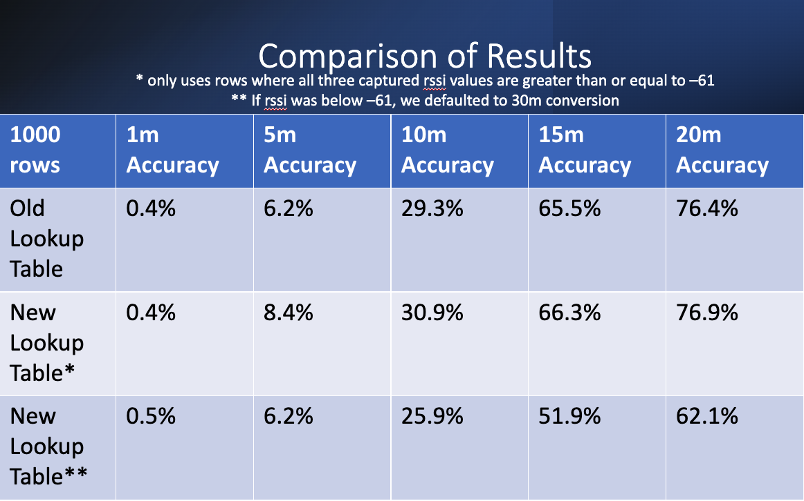
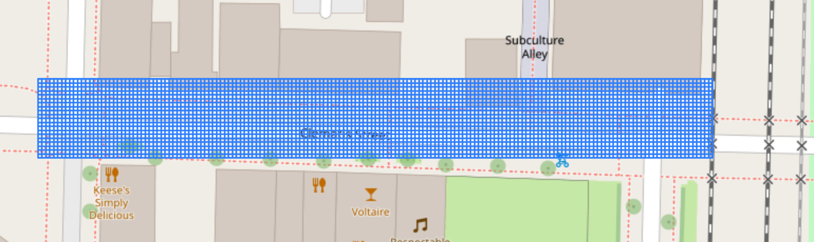
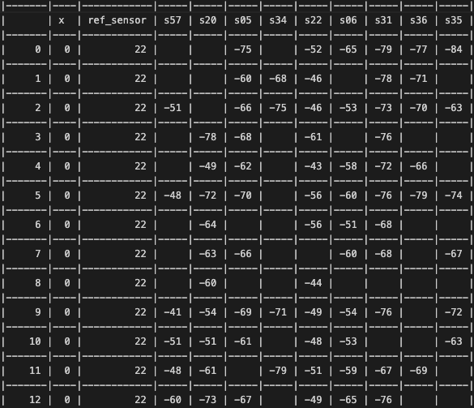
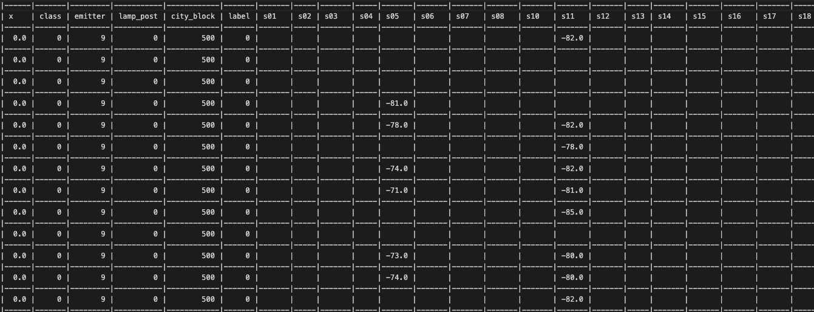
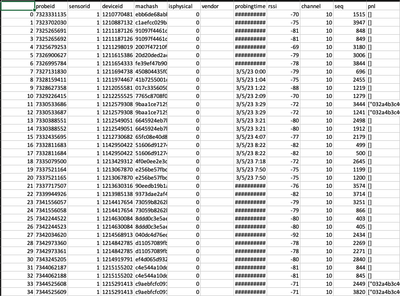
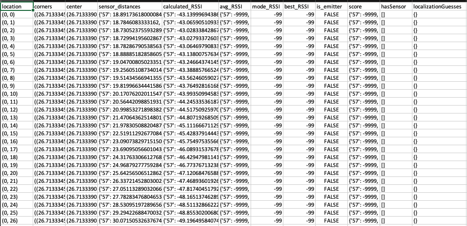

# MobIntel-Project


## Table of Contents
1. Project Description
2. Project History
3. How to Find Stuff
4. Libraries
5. Drivers
6. How to Use Libraries
7. Commenting Convention

---

### Project Description
The research question we will try to answer during this project is: how should crowds be managed in real-time during a pandemic to mitigate risk and ease the public fear of taking mass transit? This question will be addressed by bridging engineering and scientific models at the intersection of indoor pedestrian mobility, epidemiology, and travel behavior. Rather than investing in transit infrastructure and services in a short timeframe (which is especially challenging when transit agencies are struggling with staffing shortage and financial crisis), reshaping public transport mobility could be a more viable way.

This GitHub Repository is where we will compile all our code that goes towards this project. So far, this project has been working towards determining the trajectory of people along a street to help cities better plan for pandemics. With this kind of information, city planners could understand how people are moving and take precautions based on this information. As an overview, in our research, we encountered valuable insights regarding trilateration of RSSI values as a method for determining device positions. Recognizing its limitations, we shifted our focus to exploring a new avenue — the grid system. As of August 28th, 2023, we have some promising results from our grid system and are in the process of testing it with real data from the MobIntel sensors. More specific details about the history of this project can be found in the Project History Section.

---

### Project History
In this section, we will discuss the history of this project. This includes all attempted methods for solving our problem stated in the Project Description, as well as the details that went into these attempted methods so that future workers on this project can start where we left off. We initially focused on the problem of figuring out where an emitting device, such as a mobile phone, was physically located. This was necessary since we are trying to get a trajectory of a single mobile device. The end goal was to get multiple points on a map and connect them in a certain order to show the trajectory that the mobile device moved. 


#### Trilateration
Trilateration is a geometric method predicated on the utilization of distances to ascertain the coordinates of an unknown point of interest. It takes on a multilateral form when dealing with more than three distances. The proximity of multiple MobIntel sensors along Clematis Street engendered a sense of promise in trilateration as an approach, considering its applicability in scenarios where multiple data-gathering sensors are situated in close proximity to one another. These sensors, adept at gathering data concerning proximate devices, particularly harnessed the Received Signal Strength Indicator (RSSI) value emitted by the device's probe request. RSSI, signifying the strength of the signal upon reception by MobIntel sensors, exhibited an inverse correlation with distance—its potency diminishing with increasing distance from the point of origin. This prompted an inquiry into whether this RSSI-distance relationship could be harnessed for trilateration, a method contingent on known positional distances. The quest for this correlation's strength was rooted in exhaustive preliminary research. However, the empirical underpinnings revealed an intrinsic frailty in the RSSI-to-distance linkage, attributed to a multitude of intricate variables including climatic conditions, environmental context, device and sensor characteristics, thus casting doubt on its reliability. Despite this, the abundance of available data propelled the exploration into RSSI's potential as a proxy for trilateration.

Two divergent avenues were explored to operationalize trilateration in our context. The inception of a "Conversion Table" sought to establish a direct relationship between RSSI and distance. This table, available in distinct formats, underwent meticulous development, elucidated in the PowerPoint slides titled "Weekly Meeting (05-31-23)" located in the media/powerpoints directory. However, the outcomes of this approach were discrepant from the anticipated precision.



The figure presented above encapsulates the outcomes of our experimentation, featuring a dataset comprising 1000 data points tailored for trilateration. Performance evaluations of various RSSI-to-distance conversion methodologies were executed. For instance, employing the "New Lookup Table*" method yielded an 8.4% accuracy rate when ascertaining trilaterated points within a 5-meter radius of the true device location. In essence, 84 points out of the 1000 displayed an accuracy of 5 meters or less. This overall level of accuracy proved suboptimal for the intended application, thus necessitating an exploration of alternative methodologies for translating RSSI to distance for trilateration purposes.

Machine learning models constituted the second avenue of investigation, with specific emphasis on the K-Nearest Neighbors (KNN) method. Extensive datasets were harnessed to correlate individual distances with RSSI values, yielding an accuracy rate of approximately 14%. Contemplations arose regarding the potential elevation of accuracy through the correlation of a range of distances to a single RSSI value. However, these musings remained speculative, as they appeared incongruent with the project's trilateration objectives. The proposition of plotting points generated from the machine learning model was preempted by the modest accuracy levels exhibited in RSSI-to-distance conversions.

Ultimately, the pursuit of trilateration was encumbered by a confluence of challenges. Prior to undertaking this trajectory, it was acknowledged that the potency of our accuracy would be circumscribed due to the highly variable nature of RSSI. The amalgamation of diverse factors, including weather dynamics, sensor placements, environmental settings, and the conditions of devices and sensors, contributed to this variability. A number of these factors lay beyond our realm of control, while others were impracticable to measure. In summation, trilateration emerged as an unpreferred avenue for pinpointing mobile device locations, engendering an imperative to explore alternative methodologies for localization.

#### Forecasting Models
Subsequent to the resolution to pivot away from trilateration, we embarked upon an exploration of alternative conceptual avenues. Among these, the realm of forecasting models emerged as a focal point of investigation. To briefly explain, forecasting models encompass a suite of techniques tailored to collate and manipulate data, engendering reliable and precise projections. In our context, this translated to harnessing the timestamps accompanying each probe request as captured by the MobIntel sensors. Our data was primed for such methods however, despite the inherent alignment between our data and forecasting methods, a deliberation ensued, casting doubt upon the suitability of this approach for our overarching objectives.

Specifically, our current objectives centered on the accurate localization of emitting devices. While forecasting models excelled in forecasting the temporal clustering of individuals and their corresponding locations, a crucial shortcoming emerged—the inability to project the trajectories leading to these locations. As such, the forecasting methods, though proficient in prognostication, proved insufficient for our aim of tracing the trajectory of an individual device. Consequently, we adjudged the application of forecasting models infeasible within the scope of our endeavor.

#### Development of the Grid System
The grid-based approach superseded our preceding trilateration endeavors. In the trilateration methodology, instances arose wherein specific points deviated significantly from their anticipated positions. In a bid to curtail this observed error, we conceived a strategy involving the imposition of a grid structure upon the street area encompassed by our sensor network. A visual representation of this approach is depicted in the ensuing image.



The grid-based scheme serves to constrain the potential localization outcomes within the grid's boundaries, in contrast to the previously encountered instances of pronounced misplacement, as observed in the trilateration approach. In principle, a diminutive grid size is postulated to yield superior results; however, this assertion carries inherent complexities. The grid system serves as the foundational underpinning for our localization method, intricately linked to the path-loss model instrumental in distance estimation via sole reliance on the RSSI value.

Within this grid paradigm, the parameters of grid dimensions—both length and width—alongside the tile size assume a pivotal role. In the illustrative depiction above, a grid of dimensions 175x25 is presented, housing tiles of 1x1 dimensions, with all measurements denoted in meters. During the initial phases of this endeavor, we engaged datasets encompassing known emitter locations, thereby affording us the capability to map emitting devices to specific grid tiles through cross-referencing methodologies. Moreover, this facilitated the mapping of MobIntel sensors to their corresponding grid tiles. Leveraging this foundational veracity, we leveraged path-loss models to extrapolate the distance deviation between our localized estimates and actual emitter positions.

The grid architecture further facilitated the derivation of an "ideal RSSI score" for each tile respective to each sensor. This score signifies the outcome of applying a path-loss mathematical model to discern the theoretical RSSI value alignment between a given tile and a sensor. This calculation is performed across various tile-sensor distances, culminating in multiple "ideal RSSI scores" for each tile relative to the ensemble of sensors. It is from this foundation that the "calculated RSSI value" emerges—an analytical construct gauging the discrepancy between the ideal RSSI value and the empirically captured RSSI value at a designated tile location. It is pertinent to note that the latter score's determination is contingent upon tile-emitter co-location, as the actual RSSI values at these locations are integral to the computation.

This methodological shift was conceived to harness the confined spatial extent of signals received by the sensors, inherently within the precincts of the street (now encapsulated within the grid). Through this strategic pivot, we anticipated enhanced efficacy in the execution of our localization algorithm applied to data specific to the street block. Our trajectory involves the expansion of this grid scheme via one of two approaches. The first entails dedicating a separate grid to each street block, resulting in a diminished computational load, whereas the second contemplates a singular expansive grid overlaying the entirety of Clematis Street, albeit entailing a larger spatial expanse.

#### Testing the Grid System with Ground Truth Data
The grid system underwent a vigorous testing phase. As explained in the section above, we have a dataset that contains a lot of data from known emitter locations. This gives us ground truth data that we can test our localization methods with. As a result of our testing, it was noted that the majority of our localization attempts were within 10 meters of the actual location of the known emitter positions. This was a significant improvement from trilateration. 

#### Testing the Grid System with MobIntel Data
Subsequent to rigorously evaluating the precision of our dataset through comparative analysis with known emitter positions, our investigative endeavors transitioned into an experimental phase devoid of prior emitter position knowledge. This novel methodology was anchored in the principle of aggregating predominantly localized instances. Specifically, within our dataset, an approximate count of 950 probe requests emanated from a singular position. Each such request necessitates localization to a distinct tile, and it was envisioned that the collective trend of localizations would guide our determination of the "optimal localization." 

This methodology garnered demonstrable success. The preponderance of localizations for any given position is consistently clustered within a proximal distance of 10 meters from the genuine emitting device's location. The culmination of this testing phase engenders a profound degree of confidence in our ability to engender precise localizations without a priori knowledge of the emitting device's whereabouts. It is evident that the concurrent collection of all probe requests from a particular device united in temporal synchrony, yields a localization outcome. This outcome can be deemed the "best localization" with a high level of assurance, given its fidelity to the emitting device's actual location, generally within a 10-meter radius.

It is pertinent to acknowledge our concurrent exploration of the "mini-grid" concept, a venture that has showcased a marked augmentation in precision. In essence, this concept entails the creation of a localized grid encompassing areas characterized by the density of localized instances. The same localization methodology is then applied within this miniaturized grid, facilitating enhanced accuracy in localization outcomes.

As of the current date (08/28/2023), our focus is directed toward the accrual of additional data to facilitate the empirical examination of trajectory prediction within a grid-based framework. This trajectory prediction endeavor represents an ambitious pursuit, as we seek to unravel the patterns underlying the movement of devices within the defined spatial confines.

---

### Dataframes in Use
There are several types of data frames we have been working with so far. In this section, we will briefly go over some of the more common ones used so that future developers have a good understanding of them. We shall present the name of the data frame, a short description of it, and then a snapshot of the data frame for reference.

#### Block Data
This data refers to a condensed version of a fanchenWPB dataset file. The ref_sensor column refers to a sensor ID number that an emitting device is near to. The x column represents how far away the emitting device is from the ref_sensor. The distance is always in meters and always east from the ref_sensor. The proceeding columns are of the sensors that are on the same street block as the emitter. The values of these columns are RSSI values that were received. In the image below, we are looking at data from Street Block 500. This means that each emitter location was on block 500 along Clematis Street and the sensors are all within that same street block. This type of data frame can be created by using the convertFanchen() function in the DataFiltrationLib.py file.



### Fanchens WPB Data
This kind of data was created by Fanchen Bao. He went out to Clematis Street and collected his own data with the MobIntel sensors. For a visual explanation of what the columns mean in this data, please refer to slide 3 of PowerPoint presentations media/powerpoints/WeeklyMeeting(05-31-23).pptx. 



### Raw MobIntel Data
This is the data that we receive directly from the MobIntel sensors. There are a lot of columns with millions of rows. We shall briefly explain some of the more important columns. The ```probeid``` column is a unique identifier for each probe request that the MobIntel sensor captures. The ```sensorid``` column refers to the sensor that caught this signal. ```deviceid``` is a unique identifier for the device that sent the probe request. It has no correlation to the actual device. The ```machash``` column is a hashed version of the mac address of the device that sent the probe request. Many mobile devices, such as phones, create a virtual mac address, which is a randomly generated mac address that changes every time a probe request is sent out. ```isphysical``` tells us if the device has a physical mac address. Devices that have a physical mac address are usually printers, fax machines, desktop computers, landlines, etc. Essentially, devices that do not move very often. The ```probingtime``` column tells us what day and time the probe request was captured. The ```rssi``` column is the received signal strength indicator number that the sensor got when capturing the probe request. The following three columns have been of very little use to us so far. 
For a more detailed explanation of each column, please refer to the MobIntel documentation.



### Grid Data
When we create a grid structure with our code, we also flatten the structure and turn it into a csv file so that we may work with the data we developed. Each time we create a grid, this csv file is developed. Each row represents a tile within the grid. The unique identifier for each tile is the ```location``` column, which represents the coordinate of the tile within the grid. The ```corners``` column is simply the geographical coordinates of the 4 corners of each tile. This became important when we were trying to place sensors within the grid. Columns such as center, sensor_distance, is_emitter, and hasSensor are self-explanatory. However, columns such as avg_RSSI, mode_RSSI, best_RSSI, is_emitter, score, and localizationGuesses were only meaningful if we have data for known emitter locations. These columns were used for informational purposes and helped us learn a lot. When applying the grid to a real-world application, these columns should be omitted to save space. The ```calculated_RSSI``` column represents the "ideal" RSSI value, which means it shows what the RSSI value should be at the current distance between the tile location and each respective sensor location by using a path loss model.


---

### How to Find Stuff

In this readme file, we have categorized the abundant information as follows: On the highest level of organization, we have several
parent folders that contain information. The parent folders are datasets, media, pythonFiles, and webDevelopmentFiles.
Within the datasets folder, we have all the data sets that were used during our project. It also includes datasets that we 
created during our project. Mostly, they were developed from pre-existing data sets provided to us, but with analysis data added into them.
In the media folder, we include things such as images and maps. Images is self self-explanatory, but the maps section includes HTML files that were
generated via our trilateration algorithms or our grid visualization efforts. The pythonFiles folder is the meat of this assignment. Here we have 3 separate
subfolders; developmentFolder, Drivers, and Functionality. The developmentFolder is a sort of playground where each of the developers can play with some of the
code for development purposes. The Drivers folder contains Python files that utilize the libraries developed throughout this process. It tests and makes sure that
any updates given to any functionality still provide outputs that result in 0 errors. The Functionality folder holds all the libraries used in this project. For more detailed descriptions of the libraries, see the Libraries section of this readme file. Finally, the webDevelopmentFiles is the last parent folder. In this folder, we contain files that work with web development. Currently, there are two subfolders. Of the two, interactiveGrid is of larger importance. In this subfolder, we have the code for our interactive grid visualization. In the other subfolder, we have code written in PHP that revolved around various aspects of the project including trilateration, random waypointing, and other topics. 

---

### Libraries

#### RSSIToDistanceLib
This library was created to separate the functionality of converting an rssi value
to a distance. In total, there are two versions of this. The first version
"rssiToDistance()" is the older, depreciated version of this conversion. It uses an older
lookup table that was updated later on. rssiToDistanceV2() is the newest, and better, version
of this conversion. Its accuracy was better by around 2% on average. Overall, the general
method of converting an rssi value to a distance was unsuccessful due to the low accuracy of both
functions.

* rssiToDistance(rssi)
* rssiToDistanceV2(rssi)

#### PathLossLib
This library is intended to hold all functions that are related to path loss models. Path loss models
are mathematical algorithms that determine the "ideal" rssi value based on certain values such as distance, 
path loss index, transmittion power, etc.  

* freeSpacePathLossLinear(distance)
* freeSpacePathLossdB(distance)
* pathLossExponent(distance)
* FSPL(distance)
* pathLossVanilla(distance, pathLossExponent, transmitterPower)

#### GridLib
In the GridLib library, we have functions that were used to create, visualize, and analyze 
information that was used in creating the grid that lays over Clematis Street. In here, we
can create any size grid on an location on the earth. 

* GridSquare ~ Class
* adjustedLongitude(t, x)
* adjustedLatitude(t, x)
* visualizeGrid(origin, lat_dist, long_dist, meridianDist, parallelDist)
* showGrid(m, filePath)
* multipleGrids(listOfGrids, parentOrigin)
* createGrid(origin, latDistance, longDistance, adjustedMeridianDistance, adjustedParallelDistance)
* makeCoordsArray(latList, longList)
* getGridCorners(coord_array)
* getEmitterCoords(df)
* getEmitterPositions(emitter_coords, latList, longList, grid_corners)
* getDeviceGridSpot(device_loc, lats, longs, grid_corners)
* makeGrid(grid_corners, latList, longList, emitter_locs, df)
* exportGridAsCsv(grid, pathName, withIndex)
* sensorLocationsDict(sensorList)
* sensorMaxCoords(sensorList, latList, longList)
* containsSensor(tile, sensorList, latList, longList)
* averageActualRSSI(emitter_locs, df, ref_sensor_list)
* completeGrid(origin, latDistance, longDistance, adjustedMeridianDistance, adjustedParallelDistance, df500)
* localizationTest(grid, df, emitter_locs)
* gridLocalizationTest(grid, df, emitter_locs, rand_row)
* clusterCheck(loc_list, cluster_list, start_loc, grid)
* clusterLocalization(loc_list, grid, mini_grid, actual_loc)
* mini_grid(grid, start_loc, df)
* gridLocalization(grid, df, emitter_locs)
* generateLocalizationGuesses(row, grid, numberOfGuesses, data)
* csvTojson(csvFilePath, jsonPath, removeIndex=False)
* localizecsv(csvFilePath, csvOutputFilePath, localizationData)
* getActiveEmitterLocs(emitter_locs)

* # MobIntel block:
* getGridDimensions(all_data)
* GridSquareMI ~ Class
* makeGridMI(grid_corners, latList, longList, df)
* runLocalizationMI(grid, df, grid_corners)
* gridLocalizationMI(grid, df, rand_row)
* clusterCheckMI(loc_list, cluster_list, start_loc, grid)
* clusterLocalizationMI(loc_list, grid)
* mini_gridMI(grid, start_loc, df)

#### TrilaterationLib
This library includes functionality that was used to trilaterate points on map. This library uses other
libraries such as GridLib and RSSIToDistanceLib to complete some of its tasks. In here, we focus on functions
that were used to plot points on a map to visualize how successful we were trilaterating devices using rssi values.

* multilaterate(coords, dists)
* trilaterate(sXLoc, sXDist, sYLoc, sYDist, sZLoc, sZDist)
* plotRowOnMap(row, sensorSet, trueEmitterLocationSet, data, m, d=None, createCSV=False, oldVersion=True)
* getCoordinates(sensorNum)
* getEmitterCoords(row)
* isSingleDigit(num)
* jprint()
* createTrilateratedMap(df, headCount, centralPoint, pathName, d=None, createCsv=False, oldVersion=False)

#### MLLib
This library was created to hold all the functions that were used in developing
a machine-learning model. The purpose of this was to see if the k-nearest neighbors 
algorithm was helpful in picking the correct rssi value based on a given distance.
The accuracy of this machine learning model yielded around 14% each time we ran it.

* lambdaRound(row)
* sensorDistance(sensorId)
* createSubSet(x, y)
* createDataFrame(sensorId, sensorDF)
* scaleDataset(dataframe)
* KNN()

#### DataFiltrationLib
This library was intended to contain all the functions used when we filter
raw data from the MobIntel sensors. There are a lot of rows and columns that have not been
necessary for our needs throughout this project, so we developed functions to quickly
trim them down to what we need. This library also includes functions that revolve around machash-related things.

* read_file(filepath)
* sensor_trim(probe)
* mac_count(pqfile, cutoff)
* groupByMacHash(df)
* newDateCollector(row)
* deviceInSensorAreaDuration(probingTimes, DURATION_LIMIT)
* newDetermineDuration(row, durationLimit)
* determineMacHashDuration(filename)
* getSubsetByRefSensorAndX(blockDataFile, refSensor, x)
* convertFanchen(fanchenFileName)
* dataInitialization() # Don't use for Fanchen's data

#### ExploritoryAnalysisLib
This library was of separate use during the project. When we were exploring forecasting
methods, we would use some of the functions here to determine if our data was primed
for such methods. In this library, you will find functions that plot data from the MobIntel
sensors as well as separates the data into separate categories.

* createLineGraph(df, date, dayByDay=False)
* distanceCounter(dataframe)
* rssiSet()
* dateAggDf(filename)
* hourAggDf(filename)
* plotDateAgg(dateAgg)
* plotInDepthWeek(dateAgg, hourAgg)
* plotDays(dateAgg, hourAgg)

---

### Drivers
The purpose of the drivers is to showcase the functions within the library working
the way we expect them to. Some drivers are shorter than others and do not show each
function working separately. This is because some drivers have functions that utilize the specific
use case of other functions within it. If the parent function works as expected, we can assume the child
functions to be in working order. A list of the drivers will be presented here. The names of each driver correspond to which library it uses.

* RSSITOoDistanceLibDriver
* PathLossLibDriver
* GridLibDriver
* TrilaterationLibDriver
* mLLibDriver
* DataFiltrationLibDriver
* ExploritoryAnalysisLibDriver
* KNeighborsDriver

---

### How to Use Libraries

To use a library in the pythonFiles folder, we must first import the sys module, which is in the standard
library in Python. Then, we must use the path.append method to add an extra path for our 
system to search through when we are looking for libraries to use. Typically, this path will be 'pythonFiles', since it is native to the repository, and not the local device. Finally, we must call the library.
The way that we do this is by first importing from Functionality and then call the specific library I want.
I usually give it an alias as well. Below is an example code block of what this would look like:

```
import sys
sys.path.append("pythonFiles")

from Functionality import GridLib as gl
```

One could also use dot notation to grab the same library:
```
import sys
sys.path.append("pythonFiles")

import Functionality.GridLib as gl
```

### Commenting Convention
All of our functions in each library will have a comment section at the beginning. This comment is meant to help developers understand what the parameters are for the function, and what to expect in return, and lightly describe what is going on in the function, or explain the purpose of the function. To standardize these comments, we try our best to follow the following convention:


"""

paramemter(1-n): Explain what the parameter is and the object type
Returns: explain what we should expect after running this function
Description: lightl explain what the function does and why we have it

"""

We have as many parameter comments as there are in the signature of the function. For example, we write comments like this:

```
def adjustedLongitude(t, x):
  """
  t: the tuple of (lat,long) of reference location.
  x: is the distance, in meters, from the reference point.
  Returns: a new (lat,long) that is adjusted by x meters
  Description: If x is positive, this distance is eastward.
  If x is negative, this distance is westward. We return new 
  coordinates based on the current location + the value of x,
  which is a distance in meters.
  """
  .
  .
  .
```
